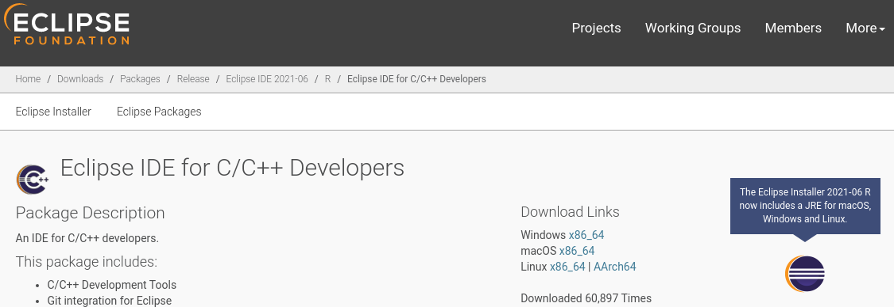
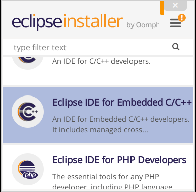

# Eclipse IDE

## Installation

Download [Eclipse IDE for C/C++ Developers](https://www.eclipse.org/downloads/packages/release/2021-06/r/eclipse-ide-cc-developers) (version 21-06) and save the installer file to /tmp.

Run the installer and install it with its to default settings, ie to user home directory. However I prefer to install all manually installed software under /opt/<user>, with <user> as the user bekr used here. 

    sudo mkdir -p /opt/bekr
    sudo chown bekr:bekr /opt/bekr

After this /opt/bekr can be written to without the sudo command..
Change to /tmp and unpack the installer archive with:

    tar -xvf eclipse-inst-jre-linux64.tar.gz

Change to the eclipse-installer directory and run the GUI installer.

    cd eclipse-installer
    ./eclipse-inst

The first installer asks, is which variant to install, select `Eclipse IDE for embedded C/C++`.

Change only the install location, in my case to /opt/bekr, then press the INSTALL button.
Once done, select LAUNCH and accept the default ~/eclipse-workspace which is the directory that will contain all our projects.

## Post installation configuration

Update Eclipse color scheme and confirm that the other plugins are installed.

Start Eclipse (if not already running) and open the menu 'Help->Eclips Marketplace...'
Then in the search box, type each 'plugins name' and then install these two plugin.

    Darkest Dark Theme with DevStyle
    CMake Editor

Installation may take a while. Progress is shown in the right lower corner.
At the restart and `Preference` dialog, select the `Darkest dark theme`. 
Absolutely stunning how well it looks.